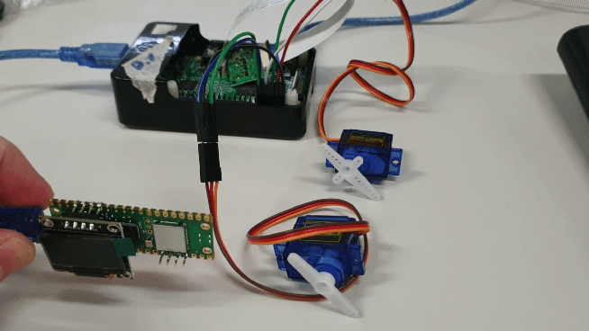

# object-remote-control

## Description
control two servo from a raspberi pie from an mpu.

## External  libraries:  
- pySerial https://github.com/pyserial/pyserial   Licence: https://github.com/pyserial/pyserial/blob/7aeea35429d15f3eefed10bbb659674638903e3a/LICENSE.txt

 

## Set Up
install pySerial on raspberi pie with pip install pyserial 
connect mpu to paspberi pie
 
identify the com port of the mpu and update the serial port on line 16 of servo_control.py
 
connect servox pwm lead from servo to raspberi pie gpio pin8
 
connect servoy pum lead from servo 2 to raspberi pie gpio pin10
 
run the code and move the mpu for results.